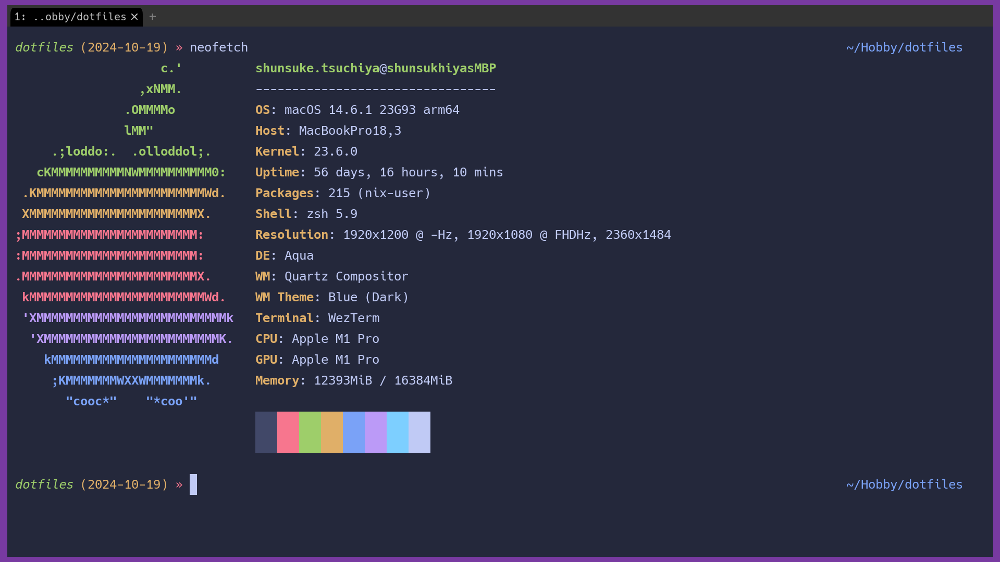

# dotfiles
This Repository is My Configuration Files for Development Environment.

## Screen Shot



## Architecture

This is project directory architecture.

```shell
.
├── README.md
├── Taskfile.yml
├── configs
│   ├── nix
│   ├── nvim
│   ├── wezterm
│   └── zsh
├── downloader
│   ├── fonts_downloader.sh
│   └── jetpack_downloader.sh
├── flake
│   ├── flake.lock
│   └── flake.nix
├── images
│   └── screen_shot.png
└── worker
    ├── entry_point
    ├── go.mod
    └── internal
```

- `Taskfile.yml`: task runner file
- `configs`: config files
- `flake`: flake.nix files (nix package manager, not `nix.conf`)
- `downloader`: downloader directory (shell script)
- `worker`: worker directory (Go project)

## Setting Files

### Neovim
neovim settings are in `./configs/nvim`.

before using following command, check if you've already install [jetpack](curl -fLo ~/.local/share/nvim/site/pack/jetpack/opt/vim-jetpack/plugin/jetpack.vim --create-dirs https://raw.githubusercontent.com/tani/vim-jetpack/master/plugin/jetpack.vim)

```shell
task jetpack
```

After that, you can run following command to update neovim settings.

```shell
task nvim
```

### Nix
nix settings are in `./configs/nix`.

```shell
task nix
```

when you add package to `flake.nix`, you need to run following command.

```shell
task flake
```

when you add package to `flake.nix`, you need to run following command.

```shell
cd flake
nix profile install .#packages
```

### Wezterm
wezterm settings are in `./configs/wezterm`.

```shell
task wezterm
```

### Zsh
zsh settings are in `./configs/zsh`.

we have two sources to update zsh settings.

1. `./configs/zsh/.zshrc`: zsh settings
2. `./configs/zsh/config`: zsh config reffered by `.zshrc`

We already addressed the problem, and all you need to do is to run following command.

```shell
task zsh
```

## Test

Worker Intenal package is tested by following command.

```shell
task test
task: [test] go test -cover ./...
        worker/entry_point/nvim         coverage: 0.0% of statements
        worker/entry_point/zsh          coverage: 0.0% of statements
        worker/entry_point/wezterm              coverage: 0.0% of statements
ok      worker/internal/handler (cached)        coverage: 70.6% of statements
ok      worker/internal/path    (cached)        coverage: 87.1% of statements
```

## License

This repository is totally open source, and you can use it for free. But, please note that this repository can be changed by me. There is no guarantee that it will be stable (Breaking changes may occur). Therefore, please use it at your own risk.

