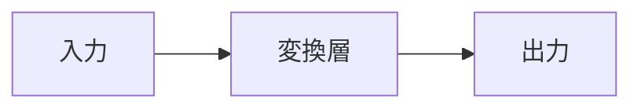

<!--
  PR 説明文テンプレート。
  PR 説明文を生成する全スキル (write__pull_request / submit__pull_request /
  restart__pull_request) が参照する single source of truth。
  各 [プレースホルダ] を実際の内容で埋め、不要な行は削除する。
  この HTML コメントは投稿前に必ず削除する。
-->
## 概要

[何をしたのか・何を解決するのかを 1〜2 文で簡潔に述べる。]

Closes #<issue-number>

## 背景

[この変更が必要になった背景を述べる。問題の発見経緯・ユーザーからの報告・
技術的負債の蓄積など、変更のきっかけとなった状況を記述する。]

## 課題

[背景のもとで具体的に何が問題だったかを述べる。解決対象を明確にする。]

## 目標

### 必須項目

- [この PR で必ず満たす条件]

### 範囲外

- [意図的にこの PR では扱わないこと]

## 採用手法

[採用したアプローチを述べる。「何をしたか」ではなく「なぜこのアプローチか」を中心に書く。]

### 検討した選択肢

| 選択肢 | 長所 | 短所 |
|--------|------|------|
| A: [採用した案] | ... | ... |
| B: [検討したが不採用] | ... | ... |

### 採用理由

[最終的にこの案を選んだ決定的な理由を述べる。]

<!--
  依存関係のあるオブジェクトを定義する場合や、層をまたぐ複雑なデータの受け渡し
  (バケツリレー) がある場合は、Mermaid 記法で関係や流れを必ず図示する。
  不要なら以下のブロックごと削除する。
-->

## 変更箇所

- `path/to/file`:[変更内容を簡潔に 1 文で]
- `path/to/other`:[変更内容を簡潔に 1 文で]

## 妥協と制限

[意図的に受け入れたトレードオフや既知の制限を正直に述べる。なければ「無し」と書く。]

- **[トレードオフ]**:[何を得て何を犠牲にしたか]

## 検証方法

[正しく動くことをどう確かめたかを簡潔に箇条書きで述べる。]

- [テスト追加 / 手動確認の手順 / 計測など]

## 確認事項

[レビュアーに確認してほしい点を箇条書きで挙げる。特に意思決定事項を ⚠️ 付きで示す。]

- ⚠️[合意したい設計判断・影響範囲・確認したい前提]

## 参考文献

- [タイトル](URL)
