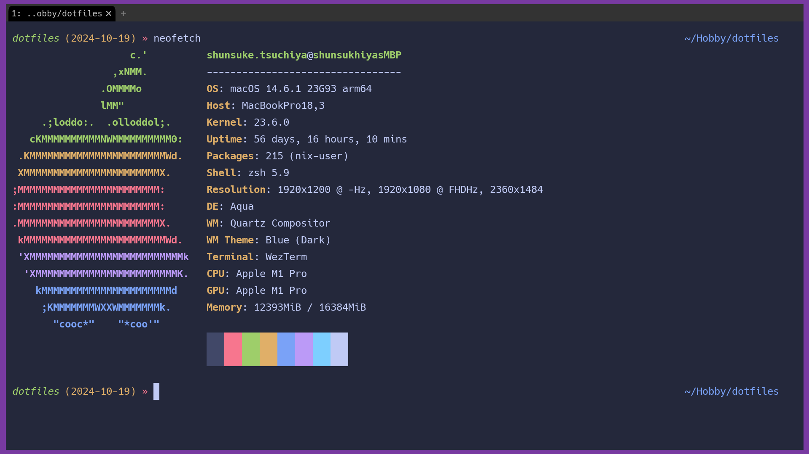

# dotfiles

This Repository is My Configuration Files for Development Environment.

## Screen Shot



## Architecture

This is project directory architecture.

```shell
.
├── README.md
├── Taskfile.yml
├── configs
│   ├── nix
│   ├── nvim
│   ├── vscode
│   ├── wezterm
│   └── zsh
├── downloader
│   ├── fonts_downloader.sh
│   └── jetpack_downloader.sh
└── worker
    ├── bin
    ├── entry_point
    ├── go.mod
    └── internal
```

- `Taskfile.yml`: Launcher for updating settings for each tools
- `configs`: Config files for each tools
- `downloader`: Downloader src (Shell Script)
- `worker`: worker src(Go project)

## Setting Files

### Neovim

neovim settings are in `./configs/nvim`.

before using following command, check if you've already install [jetpack](https://github.com/tani/vim-jetpack)

```shell
task install-jetpack
```

After that, you can run following command to update neovim settings.

```shell
task update-nvim
```

### Nix
nix settings are in `./configs/nix`.

```shell
task update-nix
```

### VSCode
vscode settings are in `./configs/vscode`.

```shell
task update-vscode
```

To install recommended extensions:

```shell
bash ./configs/vscode/extensions.sh
```

### Wezterm

wezterm settings are in `./configs/wezterm`.

```shell
task update-wezterm
```

### Zsh

zsh settings are in `./configs/zsh`.

we have two sources to update zsh settings.

1. `./configs/zsh/.zshrc`: zsh settings
2. `./configs/zsh/config`: zsh config reffered by `.zshrc`

We already addressed the problem, and all you need to do is to run following command.

```shell
task update-zsh
```

### Fonts

To download and install the recommended fonts:

```shell
task install-font
```

## Development

### Build and Test

Worker internal package can be built and tested using the following commands:

```shell
# Format code
task fmt

# Run tests
task test

# Build binaries
task build
```

Test coverage:

```shell
task test
task: [test] go test -cover ./...
        worker/entry_point/nvim         coverage: 0.0% of statements
        worker/entry_point/zsh          coverage: 0.0% of statements
        worker/entry_point/wezterm              coverage: 0.0% of statements
ok      worker/internal/handler (cached)        coverage: 70.6% of statements
ok      worker/internal/path    (cached)        coverage: 87.1% of statements
```

## License

This repository is totally open source, and you can use it for free. But, please note that this repository can be changed by me. There is no guarantee that it will be stable (Breaking changes may occur). Therefore, please use it at your own risk.

